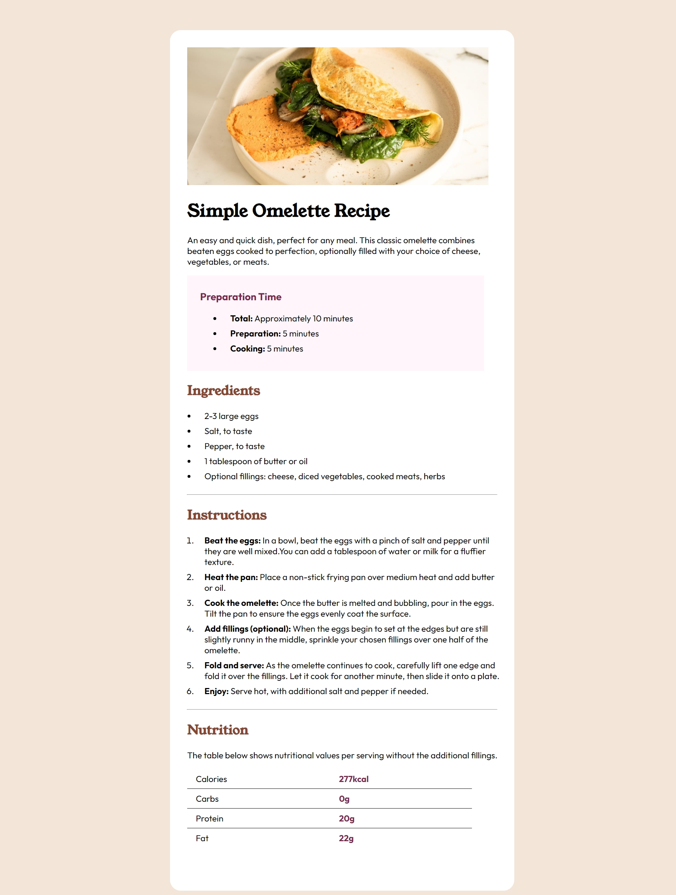

# Frontend Mentor - Recipe page solution

This is a solution to the [Recipe page challenge on Frontend Mentor](https://www.frontendmentor.io/challenges/recipe-page-KiTsR8QQKm). Frontend Mentor challenges help you improve your coding skills by building realistic projects.

### Screenshot

### Links

- Solution URL: [Click here](https://github.com/raven784/recipe-pages)
- Live Site URL: [Click here](https://raven784.github.io/recipe-pages/)

## My process

### Built with

- HTML5
- CSS3

### What I learned

Getting started with tables, it will definitely help me in later projects.
